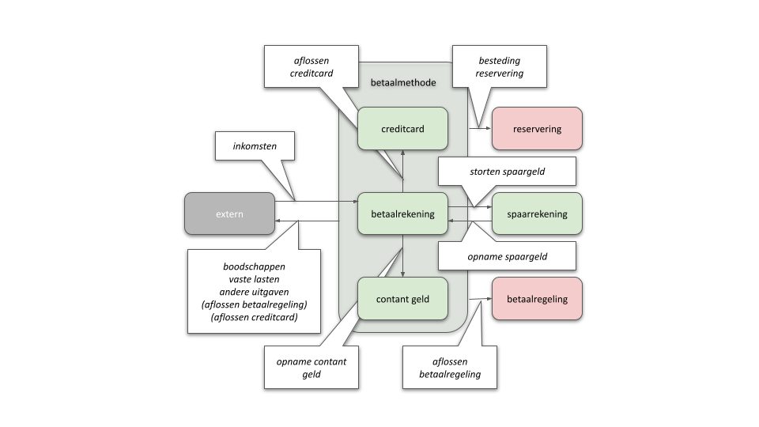
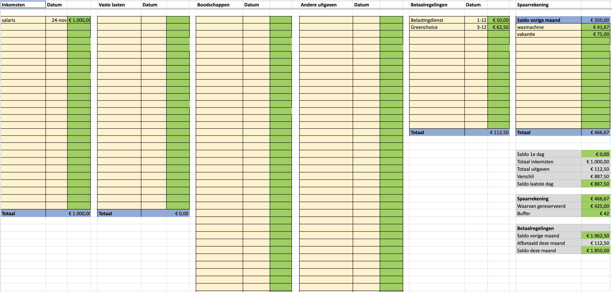

# Funtionele beschrijving

## Boekhoudkundige basis

#### Inleiding

PlusMin is gebaseerd op het [dubbel boekhouden](https://nl.wikipedia.org/wiki/Dubbel_boekhouden) waarbij elke betaling
op zijn minst op twee verschillende manieren wordt geadministreerd, en waarbij elke boeking in evenwicht moet zijn.
Hierbij worden de rekeningen opgesplitst in balansrekeningen en resultatenrekeningen.

Balansrekeningen (Rekeningen)

    Bezittingen:
        Betaalrekening
        Spaarrekening
        Contant geld
    Schulden:
        Creditcard (schuld)
        Betaalregelingen
        Reserveringen

Resultatenrekeningen (Categorie&euml;n)

    Inkomsten:
        (Salaris, uitkering, ...)
    Uitgaven:
        Boodschappen
        Vaste lasten
        Andere uitgaven

In PlusMin merkt de gebruiker hier niets van: in elke geregistreerde betaling worden zowel de debet als credit zijde in
&eacute;&eacute;n keer opgenomen: de dubbele boeking lijkt daardoor een enkelvoudige boeking. PlusMin onderscheidt 10
betalingssoorten, waarbij zowel de debet als credit zijde van de boeking worden bepaald. Het bedrag kan daardoor (bijna)
altijd als positief getal worden opgegeven.

De 10 betalingssoorten met de debet en credit rekening:

| BetalingsSoort          | Debet           | Credit           |
|-------------------------|-----------------|------------------|
| Inkomsten               | Inkomsten       | Betaalrekening   |
| Boodschappen            | _Betaalmethode_ | Boodschappen     |
| Vaste lasten            | _Betaalmethode_ | Vaste lasten     |
| Andere uitgave          | _Betaalmethode_ | Andere uitgave   |
| Aflossen betaalregeling | _Betaalmethode_ | Betaalregelingen |
| Aflossen creditcard     | Betaalrekening  | Creditcard       |
| Besteding reservering   | Betaalmethode   | Reservering      |
| Opname spaargeld        | Spaarrekening   | Betaalrekening   |
| Storten spaargeld       | Betaalrekening  | Spaarrekening    |
| Opname contant geld     | Betaalrekening  | Contant geld     |

Daar waar '_Betaalmethode_' wordt gebruikt moet de gebruiker kiezen tussen Betaalrekening, Creditcard of Contant geld.

Bij aflossen wordt een deel van geld besteed aan rente/kosten en een deel aan het verminderen van schuld; dit leidt
tot 2 boekingen in de administratie. **Aflossen (zowel op de creditcard als de betaalregeling) gaat uitsluitend over het
aflossen van de schuld**. Zie [aflossen](#aflossen).

Onderstaand diagram geeft schematisch de 10 betalingssoorten weer.

Vooralsnog ga ik er vanuit dat er 1 betaalrekening, 1 spaarrekeningen en 1 creditcard is. Het systeem kan
meervoudighied makkelijk aan maar de gebruikersinteractie wordt veel ingewikkelder.

De boekhoudkundige verwerking van reserveringen worden automagisch opgebouwd op basis van het definieren van
een [Reservering](#reserveren). Ook een betaalregeling of [betaalachterstand](#aflossen) wordt apart opgevoerd. De stand
van beide rekeningen moet in een openeningsbalans, tijdens de initi&euml;le configuratie, worden opgevoerd.

Een belangrijk voordeel van de boekhoudkundige aanpak is de eenvoud waarmee periodiek een balanstotaal kan worden
berekend, wat een goede maat is voor de financi&euml;le gezondheid. Door deze periodieke meting in de tijd uit te zetten
is de voortgang helder inzichtelijk en kan een schatting worden gedaan wanneer een doel (bijvoorbeeld schuldenvrij of
een buffer van een bepaalde hoogte) kan worden bereikt.

Een ander voordeel van de gehanteerde methode is dat alle bedragen (m.u.v. een paar heel uitzonderlijke gevallen) als
positieve getallen kunnen worden ingevoerd: de app bepaald waar het bij en waar het af moet worden gehaald.
Uitzonderingen zijn negatieve uitgaven (bijvoorbeeld een pakketje dat retour wordt gestuurd en waarvoor geld wordt
ontvangen). Dit kan als een negatieve betaling worden geboekt, maar ook als het als inkomsten wordt geboekt gaat het,
zolang het uitzondering en niet regel is, niet in een keer helemaal mis.

TODO: is dit B1 taalgebruik? of andersom: hoe maken we hier B1 taal van? Volgens ChatGPT:

- Inkomsten
- Boodschappen
- Vaste lasten
- Andere uitgave
- Betaling van een afgesproken bedrag
- Betalen van je creditcardschuld
- Geld gebruiken dat je apart hebt gezet
- Geld van je spaarrekening halen
- Geld op je spaarrekening zetten
- Opname contant geld

## Verwerking betalingen

#### Betalingen Model

De informatie die bij een betaling wordt gevraagd is:

- de betalingssoort
- bij een betalingssoort met een betaalmethode: de betaalmethode
- datum
- omschrijving
- bedrag

De [stand](#stand) van de balansrekeningen op de laatste boekingsdatum kan worden gebruikt om te controleren of alle
betaling
correct zijn verwerkt.

Als de betalingen van de bank via een camt053 bestand worden ingelezen worden in dat geval ook de volgende
velden bewaard (als extra ondersteuning bij het, eventueel geautomatiseerd, toewijzen van de Categorie):

- referentie, tegenrekening, naam_tegenrekening, betalingskenmerk, omschrijving_bank en status

Ten slotte wordt, omdat het systeem de betalingen van meerdere gebruikers vastlegd, bij de betaling ook de
betreffende hulpvrager opgeslagen.

#### Views

PlusMin biedt de mogelijkheid om te kiezen op welke manier je de transacties kunt bekijken.

| view naam             | visualisatie                             | velden                                                                          | opmerking                                                                        |
|-----------------------|------------------------------------------|---------------------------------------------------------------------------------|----------------------------------------------------------------------------------|
| dagboek               | chronologisch overzicht alle boekingen   | header: ??? per regel: datum/omschrijving/bedrag/debet/credit               | debet en credit als iconen                                                       |
| bankboek              | chronologisch overzicht alle boekingen   | header: totaal per regel: datum/omschrijving/bedrag/categorie/betaalmethode | categorie/betaalmethode als iconen verbijzondering van  &lt;per rekening&gt; |
| &lt;per categorie&gt; | chronologisch overzicht van de categorie | header: totaal per regel: datum/omschrijving/bedrag                         |                                                                                  |
| &lt;per rekening&gt;  | chronologisch overzicht van de rekening  | header: totaal per regel: datum/omschrijving/bedrag                         |                                                                                  |

Zo kan ook, als voorbeeld, een view als onderstaande spreadsheet worden opgebouwd:

De gebruiker kan meerdere views naast elkaar openen om het overzicht te vergroten.

## Budgetteren

Bij het inrichten van PlusMin moet per **categorie** een budget worden vastgelegd. Hierbij kan het Nibud worden gebruikt
voor referentie getallen. Een categorie kan worden opgebouwd uit meerdere budgetten (Vaste lasten = huur +
gas/licht/water + verzekeringen + gemeente belastingen + ...).

Van een budget kan worden aangegeven wanneer, inclusief een frequentie, en met welke bedrag het wordt uitgegeven; een
'continu'e uitgave wordt geleidelijk uitgegeven (bijvoorbeeld boodschappen), van een 'voorspelbare' uitgave heeft een
periode (bijvoorbeeld per week, maand of trimester) en een moment in die periode.

Enkele voorbeelden (zonder de bedragen):

- huur (vaste lasten): elke maand, 1x per maand, op de 1ste
- gas/elektra (vaste lasten): elke maand, 1x per maand, op de 4de
- boodschappen (boodschappen): continu
- koffie/taart met de fietsclub (anders): elke week op zondag
- aflossing betaalregeling1 (aflossing): elke maand op de 2de vrijdag van de maand

Naast het bugetteren per Categorie zijn ook het aflossingsschema van de betaalregelingen en de reserveringen bepalend.

(TODO nog verder uitwerken)

## Reserveren

Een reservering is een geoormerkt bedrag dat nodig is om aan een toekomstige verplichting (verzekeringspremie die
jaarlijks wordt betaald) of spaardoel (een nieuwe wasmachine) te voldoen. Het is een bewuste, expliciete beperking van
de bestedingsruimte.

In het kader van de financiële educatie is het aan te raden de reservering op de spaarrekening te laten storten; de
besteedbare ruimte is dan beschikbaar op de betaalrekening. Voor de hulpvrager zijn de spaarrekening en de reservering
dan synoniem geworden. Als er op de spaarrekening onvoldoende geld staat voor de reserveringen leidt dat daarom tot een
[signaal](#signalen).

Een reservering wordt bij de configuratie opgevoerd:

- de Categorie en een nadere omschrijving/naam
- een startdatum (saldo = 0) of een saldo op een datum
- een einddatum
- een eindbedrag

PlusMin berekent per reservering het benodigde bedrag, lineair, om op de einddatum voldoende te hebben gespaard. Hierbij
wordt een referentiedatum genomen, meestal het eind van de huidige inkomstenperiode.

Een repeterende reservering (voorbeeld: verzekeringspremie elke 6 maandan) wordt automatisch opnieuw aangemaakt als de
einddatum is bereikt en het eindbedrag is opgenomen.

## Aflossen

Bij aflossen wordt een deel van geld besteed aan rente/kosten en een deel aan het verminderen van schuld. Dit maakt
aflossen inherent ingewikkeld. De vrijwilliger moet hier goed over worden ge&iuml;nstrueerd en voor de hulpvrager moet
het
glashelder zijn wat er van haar hem wordt verwacht.

Bij een creditcard worden de kosten/rente aan de schuld van de card toegevoegd; deze moeten dan worden geboekt als een
boeking van 'Creditcard' naar 'Andere uitgave'; hiermee wordt de schuld op de creditcard automatisch opgehoogd en gaat
dat dus goed.

PlusMin gaat ervan uit dat de rente/kosten van een schuld bij de start van de betaalregeling opgenomen zijn in de
schuld. Met andere woorden: de betaalregeling is een annu&iuml;teit waarbij we daarna geen onderscheid meer maken tussen
de aflossing en de rente maar het volledig van de schuld afschrijven.

**Als dat niet kan gaat PlusMin er vanuit dat er bij elke betaling de aflossing en de hoogte van de rente/kosten door de
schuldeiser zijn opgesplitst; mijn advies (checken bij materiedeskundige): aflossing en rente/kosten apart laten
betalen; de rente/kosten moeten dan als een aparte boeking van _betaalmethode_ naar 'Andere uitgave', met dezelfde
omschrijving als de aflossing, worden geboekt.**

**Het wordt nog ingewikkelder als de aflossing en rente/kosten in 1 betaling worden gedaan; de schuld moet afnemen met
het aflossingsbedrag zónder de kosten dus er is dan al teveel afgeboekt op de schuld. En: hoe leg je het uit aan de
hulpvrager? Mijn voorstel zou zijn om het terug te brengen naar de vorige situatie door het aflossingsbedrag te
corrigeren/overschrijven met het juiste bedrag en een nieuwe boeking _betaalmethode_ naar 'Andere uitgave' met dezelfde
omschrijving als de aflossing op te voeren.**

**TODO: oplossen in overleg met materie deskundigen**

Per betaalregeling (en een creditcard?) met openstaande schuld wordt bij de configuratie opgevoerd:

- de periode waarmee wordt afgelost, en wanneer in die periode (zie toelichting bij [Budgetteren](#budgetteren))
- het saldo op de startdatum
- het bedrag

Bij een betaalregeling wordt bovendien opgenomen:

- een omschrijving
- aanvullende informatie zoals dossiernummers bij betrokken instanties en telefoonnummers van contactpersonen

TODO: betaalregeling is eigenlijk niet het juiste woord want het kan ook over een 'gewone' schuld gaan waar geen
expliciete betaalregeling is afgesproken

## Stand

De stand van zaken gevisualiseerd: een grafische weergave van

- de saldi van de balansrekeningen; reserveringen en betaalregelingen uitgesplitst
- het balanstotaal uitgezet in de tijd
- de reserveringen met inzicht in de mate waarin het zal worden gehaald
- de afbetalingsregelingen met inzicht in de resterende looptijd
- de uitputting van Boodschappen, Vaste lasten en Andere uitgaven ten opzichte de te verwachten uitputting ervan

TODO: nog iets anders?

## Afsluiten van een periode

PlusMin gaat ervan uit dat periodiek de vrijwilliger en hulpvrager samen zitten om de voortgang te bekijken en
bespreken, en om een nieuwe periode te openen.

- er wordt een balans opgemaakt en bewaard; dit wordt gebruikt voor de [stand](#stand)
- de resultaatrekeningen worden geschoond (de informatie wordt verwijderd om het afbreuk risico te beperken)
- de voortgang op reserveringen en aflossingen wordt besproken en eventueel opnieuw ingedeeld (bijvoorbeeld: een
  reservering waarvan de einddatum wordt uitgesteld om een gemiste afbetaling op een schuld in te halen)

TODO: verder uitwerken

## Signalen

#### Periodiciteit

Om goed te kunnen signaleren gaat PlusMin uit van een periodiciteit van de inkomsten, bijvoorbeeld elke maand of per 4
weken. Vooralsnog houdt PlusMin geen rekening met variabele inkomsten (ZZP-er) of meerdere inkomsten bronnen met een
verschillende periodiciteit. Er moet dan worden begroot met geschatte waarden en misschien moeten de signalen dan uit
worden gezet ...

#### Verwachte problemen met de uitputting van het budget

Om te bepalen of er voldoende is gespaard berekend PlusMin ook de ruimte op het moment van de berekening; hierbij wordt
het einde van de huidige inkomsten periode als uitgangspunt genomen. Alle nog te verwachten uitgaven in de resterende
periode worden berekend:

- continue uitgaven worden lineair afgeschreven om het verwachte restbedrag te berekenen
- voor periodieke betalingen wordt gecheckt of die al hebben plaatsgevonden (TODO hoe herkennen we die?); alle nog te
  verwachten periodieke uitgaven worden opgeteld
- de benodigde reserveringen voor de einddatum van de inkomstenperiode worden berekend

De som van deze 3 posten wordt vergeleken met de som van de saldi van de rekeningen; indien er op rekeningen 'rood' mag
worden gestaan kan de som van het rood staan eventueel ook worden getoond om acute cash problemen aan te zien komen.

TODO: visualisatie van de uitputting van het budget

#### Individuele signalen

Naast de verwachte uitputting van het budget in het totaal zijn er ook signalen op individuele budgetten:

- een 'continu' budget dat proportioneel al meer heeft uitgegeven dan de verstreken periode doet verwachten (te veel
  uitgegeven aan boodschappen)
- een 'voorspelbare' uitgave die nog niet is uitgegeven terwijl dat niet overeenkomt met de verwachting (de huur is op
  de 3de nog niet afgeschreven)

TODO: visualisatie van individuele signalen

## Gebruiker

#### Rollen en aanmaken gebruikers

Er zijn 3 rollen:

- co&ouml;rdinator
- vrijwilliger
- hulpvrager

De co&ouml;rdinator voert andere co&ouml;rdinatoren, vrijwilligers en hulpvragers op in Asgardeo. Hiermee kan een
gebruiker inloggen op de app. Als de gebruiker nog niet bestaat wordt deze automatisch aangemaakt, zonder profiel. De
gebruiker kan daarna zijn eigen profiel (m.u.v. de rollen) al aanpassen. Door het gebrek aan rol kan de nieuwe gebruiker
verder nog niets.

Voor andere co&ouml;rdinatoren en vrijwilligers wijst de co&ouml;rdinator ook de rollen toe. Voor hulpvragers is dit
optioneel: zodra een vrijwilliger een hulpvrager onder de hoede neemt wordt de hulpvrager rol automatisch toegewezen.

#### Profiel

Het profiel van de gebruiker omvat:

- het e-mailadres
- de bijnaam
- de rol(len)
- voor de hulpvrager de vrijwilliger die begeleidt
- voor de vrijwilliger de hulpvragers die zij/hij begeleidt
- de [reserveringen](#reserveren)
- de [betaalregelingen](#aflossen)  
- de rekeningen (betaalrekening, spaarrekening, contant en/of creditcard)
- de standaard rekening per categorie
- standaard inkomsten/uitgaven view(s)
- een aantal functionele toggles:
    - wel of geen signalen
    - ??? TODO
