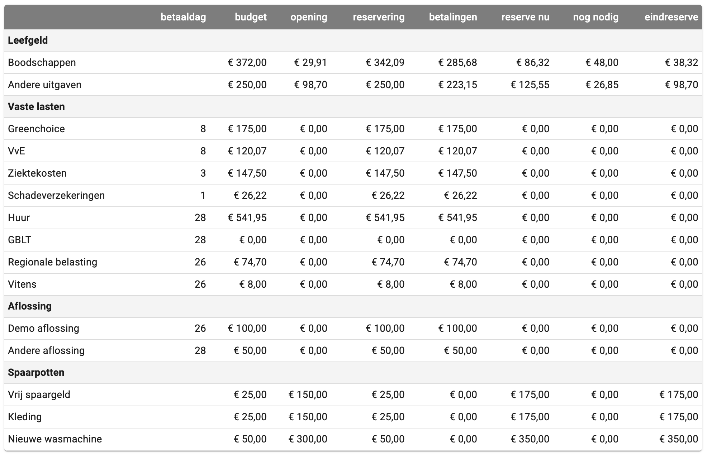

# Visualisatie challenge

## Inleiding
Onderstaande tabel is een weergave van de potjes van een fictieve hlpvrager, Alex. Alle potjes zoals die in de app worden gebruikt zijn opgenomen (zie de [home pagina](./index.md)). 

De tabel is niet de juiste weergave omdat het onvoldoende inzicht geeft ... 

## De uitdaging
Maak een visuele weergave van de potjes die Alex heeft. Zorg dat je in 1 oogopslag kan zien hoe hij er voor staat en waar actie moet worden genomen.

## De toelichting per potje
### Algemeen
De situatie is van 15 augustus 2025, en er zijn nog 4 dagen in de periode.

### Leefgeld
#### Boodschappen
Het Boodschappen potje heeft een **budget** van € 84/week; deze maand van 31 dagen betekent dat € 372,00 in de maand. Bij de **opening** van de periode zat er nog € 29,91 van de vorige periode in het potje. Het potje wordt elke maand aangevuld tot het benodigde bedrag: wat met de boodschappen wordt bespaard wordt aan de buffer toegevoegd en dus niet doorgeschoven naar de volgende periode. De **reservering** deze periode is daarom € 372,00 - € 29,91 = € 342,09. Er is nu € 285,68 **betaald**, dus er is nog € 86,32 in de **reserve nu**. Er zijn nog 4 dagen te gaan in deze periode, dus 4x € 12,00 = € 48,00 **nog nodig**. Er is naar verwachting dus nog € 38,32 aan **eindreserve**.

#### Andere uitgaven
Het Andere uitgave potje heeft een **budget** van € 250,00 per maand. Bij de **opening** van de periode zat er nog € 98,70 van de vorige periode in het potje. Het potje wordt elke maand aangevuld met het benodigde bedrag: wat met de Andere uitgaven wordt bespaard wordt  doorgeschoven naar de volgende periode. Hierdoor kun je voor Andere uitgaven dus sparen. De **reservering** deze periode is daarom € 250,00. Er is nu € 223,15 **betaald**, en dit is € 5,41 meer dan de verwachte € 217,74. 

dus er is nog € 98,70 + € 250,00 - € 223,15 = € 125,55 in de **reserve nu**. Er zijn nog 4 dagen te gaan in deze periode, dus 4x € 12,00 = € 48,00 **nog nodig**. Er is naar verwachting dus nog € 38,32 aan **eindreserve**.

### Vaste lasten en Aflossen
De Vaste lasten en Aflossingen spreken redelijk voor zich; er is een betaaldatum per vaste last/aflossing; in het voorbeeld zijn die datums allemaal al geweest en zijn ze allemaal netjes betaald. De **reserve nu** is dus € 0,00, er is €0,00 nog nodig en de **eindreserve** is dus ook € 0,00.

### Spaarpotten
De Spaarpotten zijn de potjes voor later. De bedragen zijn de bedragen die in de potjes zitten, en de reservering is het bedrag dat nog nodig is om het doel te bereiken. De **reserve nu** is dus het bedrag dat in de potjes zit, en de **eindreserve** is het bedrag aan het einde van de periode.