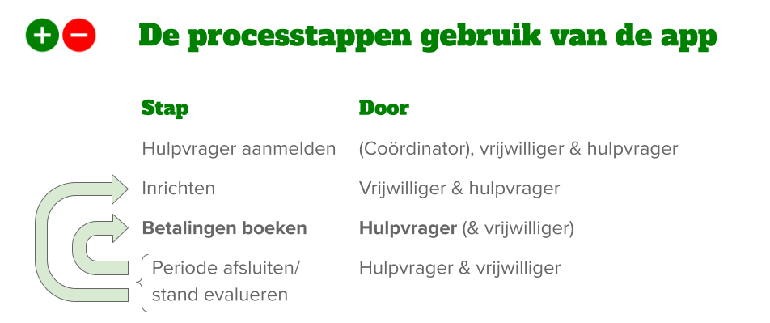

# Gebruikers interactie

## Fasering

De gebruiker die PlusMin gaat gebruiken zal een aantal stappen doorlopen:

1. aanmelden voor de app
2. samen met de vrijwilliger inrichten van de app
3. opvoeren van betalingen in de app (a.k.a. het bijhouden van het huishoudboekje)
4. evalueren van de stand van zaken en afsluiten van een periode

Na stap 4 kan met stappen 2 (wijzigen inrichting) en 3 (opvoeren betalingen) worden doorgegaan.   

In deze versie van de documentatie beperk ik me to het opvoeren van betalingen

## 3. Opvoeren betalingen

Bij het opvoeren van een betaling moet de gebruiker kiezen uit de volgende soorten betalingen:

- Inkomsten
- Uitgave
- Aflossing lening
- Aflossen creditcard
- Besteden reservering
- Opname spaargeld
- Storten spaargeld
- Opname contant geld
- Storten contant geld

Het doel is de gebruiker zoveel mogelijk aan de hand te nemen en relevante velden voor te vullen. Daarnaast wijzigen de
in te vullen velden per betalingssoort. Pas als de betalingssoort is gekozen worden de invoervelden getoond; tot dat
moment worden de velden vervangen door uitgegrijsde suggestie blokken.

Voor de algemene flow wordt eerst (voor betalingssoort Uitgave) in een tabel de interactie tussen gebruiker en systeem
in 2 kolommen beschreven. In de tabel worden de gebruikersactie en de daarop volgende systeem reactie opgesomd.

Vervolgens wordt per betalingssoort alleen de informatie gegeven die daarvoor nodig is.

#### Uitgave

| Gebruikersactie                                                                    | Systeem reactie                                                                                                                                                                                            |
|------------------------------------------------------------------------------------|------------------------------------------------------------------------------------------------------------------------------------------------------------------------------------------------------------|
| opent de app op de telefoon, logt in,  opent INKOMSTEN/UITGAVEN                | toont de standaard view voor de gebruiker                                                                                                                                                                  |
| klikt op 'toevoegen betaling'                                                      | opent de 'toevoegen betaling' dialoog datum staat default op vandaag, overige velden leeg  of afwezig                                                                                                  |
| eventueel: klikt op de datum, kiest een andere datum                               |                                                                                                                                                                                                            |
| kiest categorie 'Uitgave'                                                          | als er meerdere uitgave rekeningen zijn: geeft een drop-down met de namen van de uitgave rekeningen vult de betaalmethode 'Betaalrekening' als drop-down  met andere keuzes 'Contant' of 'Credit card' |
| kiest 'contant geld' ipv 'betaalrekening' vult bedrag in, als positieve waarde |                                                                                                                                                                                                            |
| klikt op opslaan                                                                   | sluit de 'toevoegen betaling' dialoog; opent eventueel een nieuwe toont het nieuwe saldo van de betaalrekening bij de saldi                                                                            |

&nbsp;

#### Aflossing lening, aflossing creditcard

Door de combinatie van aflossing en rente/kosten is dit de lastigste; keuze uit 2 opties, die eventueel afhankelijk van
de lening/creditcard gekozen kunnen worden

Optie1: aflossing en rente/kosten bij de invoer scheiden:

| Veldnaam         | Waarde                                                                                                                                                                                                      |
|------------------|-------------------------------------------------------------------------------------------------------------------------------------------------------------------------------------------------------------|
| betaalregelingen | 'betaalregeling1' als drop-down  met de andere betaalregelingen als mogelijke keuzes; als er maar 1 lening (of creditcard in het geval van credit cards) is, is het een tekstveld en geen drop down |      
| aflossing        | positief bedrag in &euro;s van de aflossing, exlusief de rente en kosten                                                                                                                                    |      
| rente/kosten     | positief bedrag in &euro;s van de de rente en kosten, exlusief de aflossing                                                                                                                                 |      
| betaalmethode    | 'betaalrekening' als drop-down  met andere keuzes 'Contant' of 'Credit card'; eventueel meerdere betaalrekeningen of credicards TODO bruikbaarheid beoordelen                                               |      

&nbsp;

Optie 2: totale aflossing (dus inclusief rent/kosten) en op basis van het nieuwe saldo de rente/kosten berekenen

| Veldnaam         | Waarde                                                                                                                                                                                                      |
|------------------|-------------------------------------------------------------------------------------------------------------------------------------------------------------------------------------------------------------|
| betaalregelingen | 'betaalregeling1' als drop-down  met de andere betaalregelingen als mogelijke keuzes; als er maar 1 lening (of creditcard in het geval van credit cards) is, is het een tekstveld en geen drop down |      
| aflossing        | positief bedrag in &euro;s van de aflossing, inclusief de rente en kosten                                                                                                                                   |      
| nieuw saldo      | positief bedrag in &euro;s van het saldo na de aflossing                                                                                                                                                    |      
| betaalmethode    | 'betaalrekening' als drop-down  met andere keuzes 'Contant' of 'Credit card'; eventueel meerdere betaalrekeningen of credicards TODO bruikbaarheid beoordelen                                               |      

&nbsp;

#### Besteding reservering

| Veldnaam      | Waarde                                                                                                                                                        |
|---------------|---------------------------------------------------------------------------------------------------------------------------------------------------------------|
| reservering   | 'reservering1' als drop-down  met de andere reserveringen als mogelijke keuzes; als er maar 1 reservering is, is het een tekstveld en geen drop down          |      
| bedrag        | positief bedrag in &euro;s van de reservering                                                                                                                 |      
| betaalmethode | 'betaalrekening' als drop-down  met andere keuzes 'Contant' of 'Credit card'; eventueel meerdere betaalrekeningen of credicards TODO bruikbaarheid beoordelen |      

&nbsp;

#### Opname spaargeld, storten spaargeld

Het voorbeeld geeft het storten, bij opname zijn van en naar omgewisseld.

| Veldnaam | Waarde                                                                                            |
|----------|---------------------------------------------------------------------------------------------------|
| van      | 'betaalrekening' als tekstveld; eventueel meerdere betaalrekeningen TODO bruikbaarheid beoordelen |      
| naar     | 'spaarrekening' als tekstveld; eventueel meerdere spaarrekeningen TODO bruikbaarheid beoordelen   |      
| bedrag   | het gestorte (of opgenomen) bedrag                                                                |      

&nbsp;

#### Opname contant geld

| Veldnaam | Waarde                                                                                                                                          |
|----------|-------------------------------------------------------------------------------------------------------------------------------------------------|
| van      | 'betaalrekening' als drop-down  met andere keuze 'Credit card'; eventueel meerdere betaalrekeningen of credicards TODO bruikbaarheid beoordelen |      
| bedrag   | het opgenomen bedrag                                                                                                                            |      
