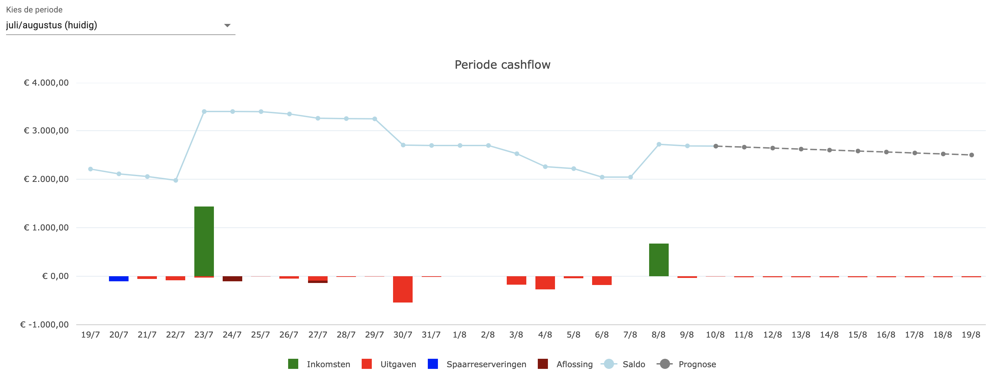
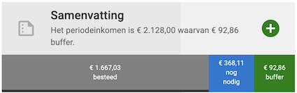

# De potjes app

## Inleiding: Grip op geld met potjes

De PlusMin-app helpt mensen met financiële uitdagingen om overzicht en rust te krijgen in hun geldzaken. De app is speciaal ontworpen voor een hulpvrager en budgetcoach, die allebei toegang hebben tot dezelfde data. Zo kunnen ze samen plannen, bijsturen en inzicht krijgen — helder, transparant en in één oogopslag.

De app werkt op basis van **maandperiodes**, waarbij de startdatum vrij te kiezen is. Het is verstandig om een periode te laten beginnen vlak vóór het moment waarop het belangrijkste inkomen binnenkomt, zodat je vanaf dag één kunt plannen.

## Budgetteren alsof je met potjes werkt

Stel je voor: je zit aan de keukentafel met je geld voor deze maand voor je op een stapeltje. Je verdeelt het over potjes (of enveloppen): één voor de huur, één voor boodschappen, één voor kleding, enzovoorts. Deze app vertaalt dit tastbare principe naar een digitale omgeving. Elk potje vertegenwoordigt een doel of uitgavenpost, en laat precies zien hoeveel geld erin zit — en of dat voldoende is. Je kunt eenvoudig geld van het ene potje overhevelen naar het andere, bijvoorbeeld als je meer geld nodig hebt voor boodschappen deze maand.

## Potjes voor nu en potjes voor later

Er zijn vier soorten potjes, verdeeld over twee categorieën:

### Potjes voor nu

Potjes voor nu zijn de potjes die nodig zijn voor de huidige periode, de maand waarin je nu zit. Ze zijn bedoeld om de vaste lasten en dagelijkse uitgaven te dekken, en om schulden af te lossen. Elk potje heeft een eigen doel en is apart in te stellen.

1. **Leefgeld**
   Voor dagelijkse uitgaven zoals boodschappen of verzorging. Je kunt werken met een maandbudget of een weekbudget (dat automatisch omgerekend wordt naar de maand). Er kunnen meerdere leefgeldpotjes zijn.

2. **Vaste lasten**
   Voor maandelijkse uitgaven zoals huur, gas, water of verzekeringen. Je stelt in wanneer en hoe vaak de betaling plaatsvindt. Als de vaste last niet elke maand wordt afgeschreven geef je aan in welke maanden wel.Per vaste last is er een apart potje.

3. **Aflossen**
   Voor het afbetalen van schulden. Net als bij vaste lasten stel je in wanneer en hoeveel er betaald moet worden. De app houdt ook bij hoeveel schuld er nog openstaat. Elk potje staat voor één schuld.

### Potjes voor later

Potjes voor later zijn bedoeld voor uitgaven die je in de toekomst verwacht, en dus niet voor de huidige periode. Als zich een tegenvaller voordoet, of als je deze periode op de vakantie gaat waarvoor je hebt gespaard, kun je deze potjes natuurlijk wel in ook de huidige periode gebruiken om de uitgaven te dekken.

4. **Sparen**
   Voor uitgaven die je pas later verwacht, zoals een vakantie of nieuwe wasmachine. Je kunt een spaardoel instellen met een deadline of gewoon geld reserveren om de hoeveelheid geld die je uitgeeft (bijvoorbeeld aan kleding) te kunnen beperken en grotere uitgaven (bijvoorbeeld een nieuwe winterjas) toch te kunnen betalen.

## Alles draait om overzicht

Op het dashboard zie je in één oogopslag hoe je ervoor staat in de lopende periode. Een visuele **cashflowgrafiek** toont wanneer het geld binnenkomt en wanneer het eruit gaat. De cashflow toont de stand van de rekeningen min de stand van de spaarpotjes. Als je de spaarpotjes op de spaarrekening zet (wat niet noodzakelijk is, maar wel aan te raden voor goed overzicht) is het dus het verloop van de (deels verwachte) stand van je betaalrekening in de periode.

Een belangrijke graadmeter is de **reservebuffer**: dit is wat je deze periode overhoudt na aftrek van alles wat je al hebt uitgegeven en nog moet betalen.  De reservebuffer toont de stand van de rekeningen min de stand van álle potjes. Omdat, als het goed is, je met de reserveringen uit de potjes aan alle verplichtingen kan voldoen, geeft de reservebuffer de ruimte aan waarmee je kleine tegenvallers kunt opvangen. (Voor grotere tegenvallers moet je een buffer aanleggen in de spaarpotjes).

## Dynamisch en realistisch

* Potjes worden alleen gevuld met geld dat **daadwerkelijk op je bankrekening staat**.
* Inkomsten worden bij binnenkomst automatisch verdeeld over de potjes:

    1. Eerst worden de potjes voor vaste lasten, aflossingen en leefgeld aangevuld, in chronologische volgorde.
    2. Daarna wordt geld verdeeld over de spaarpotjes.
* Je ziet tot welke datum elk potje “gevuld” is, zodat je weet hoe ver je vooruit kunt.
* Je kunt geld verplaatsen tussen (spaar)potjes, bijvoorbeeld als een spaarplan verandert.

## Samen werken aan financiële rust

Deze app is een praktische, visuele en toegankelijke manier om het budgetbeheer te structureren. Hulpvragers krijgen overzicht, duidelijkheid en regie; vrijwilligers hebben een handig hulpmiddel om op een positieve manier te ondersteunen. Samen werken ze toe naar financiële stabiliteit — potje voor potje.
