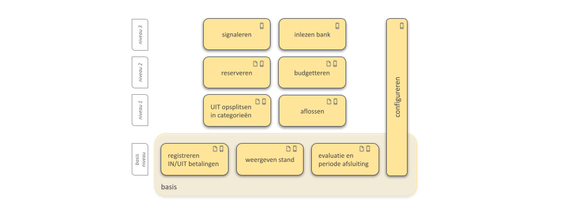

# Funtionele beschrijving

## Boekhoudkundige basis

#### Inleiding

PlusMin is gebaseerd op het [dubbel boekhouden](https://nl.wikipedia.org/wiki/Dubbel_boekhouden) waarbij elke betaling
op zijn minst op twee verschillende manieren wordt geadministreerd, en waarbij elke boeking in evenwicht moet zijn.
Hierbij worden de rekeningen opgesplitst in balansrekeningen en resultatenrekeningen.

Balansrekeningen (Rekeningen)

    Activa:
        Betaalrekening
        Spaarrekening
        Contant geld
    Passiva:
        Creditcard
        Schuld
        Reservering

Resultatenrekeningen

    Inkomsten:
        (Salaris, uitkering, rente, ...)
    Uitgaven:
        (Boodschappen, vaste lasten, andere uitgaven, ...)

Let op: per hulpvrager, per rekening, kunnen meerdere varianten worden benoemd. Bijvoorbeeld: Uitgaven opdelen in
boodschappen, vaste lasten en andere uitgaven. Of verschillende schulden tegelijkertijd afbetalen.

In PlusMin merkt de gebruiker hier niets van: in elke geregistreerde betaling worden zowel de debet als credit zijde in
&eacute;&eacute;n keer opgenomen: de dubbele boeking lijkt daardoor een enkelvoudige boeking. PlusMin onderscheidt 8
betalingssoorten, waarbij zowel de debet als credit zijde van de boeking worden bepaald. Het bedrag kan daardoor
altijd als positief getal worden opgegeven.

De 10 betalingssoorten met de debet en credit rekening:

| BetalingsSoort       | Debet           | Credit             |
|----------------------|-----------------|--------------------|
| Inkomsten            | Inkomsten       | _Ontvangstmethode_ |
| Rente                | Inkomsten       | Spaarrekening      |
| Uitgaven             | _Betaalmethode_ | Uitgaven           |
| Besteden reservering | _Betaalmethode_ | Reservering        |
| Aflossen schuld      | Betaalrekening  | Schuld             |
| Aflossen creditcard  | Betaalrekening  | Creditcard         |
| Opname spaargeld     | Spaarrekening   | Betaalrekening     |
| Storten spaargeld    | Betaalrekening  | Spaarrekening      |
| Opname contant geld  | Betaalrekening  | Contant geld       |
| Storten contant geld | Contant geld    | Betaalrekening     | 

Daar waar '_Betaalmethode_' wordt gebruikt kan de gebruiker kiezen tussen Betaalrekening, Creditcard of Contant geld.

Daar waar '_Ontvangstmethode_' wordt gebruikt kan de gebruiker kiezen tussen Betaalrekening of Contant geld.

Voor de gebruikersinteractie wordt geredeneerd vanuit de beschikbare middelen:

- Betaalrekeningen
- Spaarrekeningen
- Contant
- Credit Cards
- Reserveringen

Reserveringen staan dwars de eerste 4 onderdelen.

De kerntaak van de hulpvrager in de context van PlusMin is het opvoeren van 'betalingen' of 'boekingen'. We delen deze
in in 3 categorieën:

#### Inkomsten:

Betalingen waarbij er van 'buiten' geld bij komt, bij de beschikbare middelen, dus de BetalingsSoorten Inkomsten en
Rente

#### Uitgaven:

Betalingen waarbij er geld vanuit de beschikbare middelen naar buiten gaat, dus de BetalingsSoorten Uitgaven, Besteden
reservering en Aflossen schuld.

#### Intern (schuiven):

Betalingen waarbij er binnen de beschikbare middelen geld van het ene 'vakje' naar een ander 'vakje' wordt geschoven,
inclusief de incasso van de creditcard.

PlusMin staat toe voor veel rekeningen meerdere varianten te inrichten. Voor Inkomsten en voor de Betaalmethoden is
slechts 1 variant mogelijk. Als er meerdere varianten van een rekening zijn, moet de gebruiker de betreffende variant
kiezen. Hierdoor wordt de gebruikersinteractie complexer. Er moet hier
daarom terughoudend mee worden omgegaan.

### Inrichten

Bij het inrichten kan worden gekozen om het aantal RekeningSoorten en het aantal BetalingsSoorten te beperken.

Het meest eenvoudige model heeft 3 rekeningen met 3 RekeningSoorten: Inkomsten, Uitgaven en een Betaalmethode (
bijvoorbeeld Contant geld). Op basis hiervan zijn er 2 BetalingsSoorten mogelijk, namelijk Inkomsten en Uitgaven. Als er
maar 1 Betaalmethode kan er voor worden gekozen deze onzichtbaar te maken in de User Interface.

Het meest complexe model heeft alle RekeningSoorten en meerdere rekeningen per RekeningSoort.

## Groeimodel

Zoals in de beschrijving van de [motivatietheorie](index.md#motivatietheorie) is aangegeven, moet de administratie
mee kunnen groeien met de hulpvrager. In de app worden de volgende niveaus onderscheiden:

- basis niveau: verwerken van betalingen, periodeafsluitingen en weergave van de stand
- niveau 1: aflossen
- niveau 1: budgetteren/reserveren
- niveau 2: signaleren

## Budgetteren

Een budget is een geoormerkte uitgave binnen 1 inkomsten cyclus waarvoor een bedrag wordt gereserveerd. Voor alle
rekeningen, met uitzondering van de bezittingen, kan een budget wordt opgesteld. Deze rekeningen worden de
budgetrekeningen genoemd:

- Inkomsten
- Uitgaven
- Creditcard (aflossen creditcard schuld)
- Schulden
- Reserveringen

Bij het inrichten van PlusMin kan per budgetrekening een budget worden vastgelegd. Hierbij kan het Nibud worden gebruikt
voor referentie getallen. Een budget kan worden opgebouwd uit meerdere deelbudgetten (Vaste lasten = huur +
gas/licht/water + verzekeringen + gemeente belastingen + ...).

Van een budget wordt aangegeven wanneer, inclusief een frequentie, en met welke bedrag het wordt uitgegeven; een
'continu'e uitgave wordt geleidelijk uitgegeven (bijvoorbeeld boodschappen), van een 'voorspelbare' uitgave heeft een
periode (bijvoorbeeld per week, maand of trimester) en een moment in die periode.

Enkele voorbeelden (zonder de bedragen):

- huur: elke maand, 1x per maand, op de 1ste
- gas/elektra: elke maand, 1x per maand, op de 4de
- boodschappen: continu
- koffie/taart met de fietsclub: elke week op zondag
- aflossing belastingdienst: elke maand op de 2de vrijdag van de maand

Naast budgetten zijn ook het [aflossingsschema](#aflossen) van de schulden en de [reserveringen](#reserveren)
bepalend voor de beschikbare financi&euml;le ruimte per periode.

(TODO nog verder uitwerken)

## Reserveren

Een reservering is een geoormerkt bedrag dat nodig is om aan een toekomstige (het overstijgt een inkomsten cyclus)
verplichting te voldoen. Voorbeelden: een verzekeringspremie die jaarlijks wordt betaald of een spaardoel, bijvoorbeeld
een nieuwe wasmachine. Het is een bewuste, expliciete beperking van de bestedingsruimte.

Het verschil tussen een budget en een reservering is de periode die het bestrijkt: zodra het de inkomstenperiode
overstijgt is het een reservering en wordt er, periodiek, automatisch een bedrag op de Reserveringen rekening geboekt.

PlusMin berekent per reservering het benodigde bedrag, lineair, om op de einddatum voldoende te hebben gespaard. Hierbij
wordt een referentiedatum genomen, meestal het eind van de huidige inkomstenperiode. Een repeterende reservering
(voorbeeld: verzekeringspremie elke 6 maanden) wordt automatisch opnieuw aangemaakt als de einddatum is bereikt en het
eindbedrag is opgenomen.

Reserveren, de handeling van het opzij zetten van een bedrag om een toekomstige uitgave, haalt dat bedrag van het
besteedbare budget af en is het dus een negatief bedrag. Het is een betaling van de Reservering (een balans rekening)
naar de Uitgave rekening waar de besteding voor wordt gedaan. Het staat daardoor als een negatief bedrag op de balans.
Dat is contra-intu&iuml;tief. Het Besteden (van de) reservering heeft geen gevolgen voor de balans: het bedrag gaat dan
van
een Betaalmethode (een balansrekening) naar Reservering (ook een balansrekening). Eigenlijk is Reserveren dus geld
uitgeven zonder het &eacute;cht uit te geven ...

In het kader van de financi&euml;le educatie is het aan te raden de reservering op de spaarrekening te laten storten; de
besteedbare ruimte is dan beschikbaar op de betaalrekening. Voor de hulpvrager zijn de spaarrekening en de reservering
dan synoniem geworden. Als er op de spaarrekening onvoldoende geld staat voor de reserveringen leidt dat daarom tot een
[signaal](#signaleren).

Een reservering wordt bij de inrichting opgevoerd:

- de uitgave Resultaatrekening
- een nadere omschrijving/naam
- een startdatum (saldo = 0) of een saldo op een datum
- een einddatum
- een eindbedrag

## Aflossen

Aflossen is het afbetalen van een schuld. Bij aflossen wordt een deel van geld besteed aan rente/kosten en een deel aan
het verminderen van schuld. Dit maakt aflossen inherent ingewikkeld. De vrijwilliger moet hier goed over worden
ge&iuml;nstrueerd en voor de hulpvrager moet het glashelder zijn wat er van haar hem wordt verwacht.

Bij een creditcard worden de kosten/rente aan de schuld van de card toegevoegd; deze toevoeging aan de schuld moet
worden geboekt als een boeking van 'Creditcard' naar 'Andere uitgave'; hiermee wordt de schuld op de creditcard
automatisch opgehoogd en gaat dat dus goed.

Bij terugbetalen van schulden wordt vaak een bedrag per maand afgesproken. De rente kan in de loop van de tijd wisselen
en de rente en kosten zijn niet altijd transparant. De looptijd van de afbetaling is dan niet op voorhand precies te
bepalen. PlusMin kiest ervoor deze complexiteit (in het kader van eenvoud boven juistheid) plat te slaan: de afbetaling
moet worden ingericht als 'benadering'; het afbetaalde bedrag wordt volledig in mindering gebracht op de schuld.
Bij de restschuld wordt aangegeven dat dit een 'benadering' is die periodiek moet wordt gecorrigeerd op basis van
informatie van de schuldeiser.

Indien het binnen de competentie van de hulpvrager past kan er altijd voor worden gekozen de aflossing uit te splitsen
in 2 boekingen: de aflossing als 'aflossen schuld' de rente/kosten als 'andere uitgave'; de som van de boekingen
is dan het overgemaakte bedrag. Bij een annu&iuml;teit moet er rekening worden gehouden dat de rente en de kosten in de
loop van de tijd wijzigen. Het is altijd aan te raden bij de schuldeiser na te gaan of de PlusMin app nog klopt.

Per schuld (en een creditcard?) met openstaande schuld wordt bij de inrichting opgevoerd:

- de periode waarmee wordt afgelost, en wanneer in die periode (zie toelichting bij [Budgetteren](#budgetteren))
- het saldo op de startdatum
- het bedrag
- 'precies' of 'benadering'

Bij een schuld wordt bovendien opgenomen:

- een omschrijving
- aanvullende informatie zoals dossiernummers bij betrokken instanties en telefoonnummers van contactpersonen

TODO: schuld is eigenlijk niet het juiste woord want het kan ook over een 'gewone' schuld gaan waar geen
expliciete schuld is afgesproken

## Stand

De stand van zaken gevisualiseerd: een grafische weergave van

- de saldi van de balansrekeningen; reserveringen en schulden uitgesplitst
- het balanstotaal uitgezet in de tijd
- de reserveringen met inzicht in de mate waarin het zal worden gehaald
- de afbetalingsregelingen met inzicht in de resterende looptijd
- de uitputting van Uitgaven ten opzichte de te verwachten uitputting ervan

TODO: nog iets anders?

## Afsluiten van een periode

PlusMin gaat ervan uit dat periodiek de vrijwilliger en hulpvrager samen zitten om de voortgang te bekijken en
bespreken, en om een nieuwe periode te openen.

- er wordt een balans opgemaakt en bewaard; dit wordt gebruikt voor de [stand](#stand)
- er wordt een nieuwe openingsbalans opgemaakt, op basis van de eindbalans van de vorige periode; de balans kan dus
  afwijken
- de resultaatrekeningen worden geschoond (de informatie wordt verwijderd om het afbreuk risico bij een hack te
  beperken; de informatie blijft grotendeels in de bank- en creditcard apps beschikbaar)
- de ruimte van de budgetten wordt besproken en eventueel gewijzigd
- de voortgang op reserveringen en aflossingen wordt besproken en eventueel opnieuw ingedeeld (bijvoorbeeld: een
  reservering waarvan de einddatum wordt uitgesteld om een gemiste afbetaling op een schuld in te halen)

TODO: verder uitwerken

## Signaleren

#### Periodiciteit

Om goed te kunnen signaleren gaat PlusMin uit van een periodiciteit van de inkomsten, bijvoorbeeld elke maand of per 4
weken. Vooralsnog houdt PlusMin geen rekening met variabele inkomsten (ZZP-er) of meerdere inkomsten bronnen met een
verschillende periodiciteit. Er moet dan worden begroot met geschatte waarden en misschien moeten de signalen dan uit
worden gezet ...

#### Verwachte problemen met de uitputting van het budget

Om te bepalen of er voldoende is gespaard berekend PlusMin ook de ruimte op het moment van de berekening; hierbij wordt
het einde van de huidige inkomsten periode als uitgangspunt genomen. Alle nog te verwachten uitgaven in de resterende
periode worden berekend:

- continue uitgaven worden lineair afgeschreven om het verwachte restbedrag te berekenen
- voor periodieke betalingen wordt gecheckt of die al hebben plaatsgevonden (TODO hoe herkennen we die?); alle nog te
  verwachten periodieke uitgaven worden opgeteld
- de benodigde reserveringen voor de einddatum van de inkomstenperiode worden berekend

De som van deze 3 posten wordt vergeleken met de som van de saldi van de rekeningen; indien er op rekeningen 'rood' mag
worden gestaan kan de som van het rood staan eventueel ook worden getoond om acute cash problemen aan te zien komen.

Voor vaste lasten wordt periodiek een signaal afgegeven dat gecheckt moet worden of er een wijziging heeft
plaatsgevonden, bijvoorbeeld een jaar na de laatste wijziging.

## Gebruiker

#### Rollen en aanmaken gebruikers

Er zijn 3 rollen:

- co&ouml;rdinator
- vrijwilliger
- hulpvrager

De co&ouml;rdinator voert andere co&ouml;rdinatoren, vrijwilligers en hulpvragers op in Asgardeo. Hiermee kan een
gebruiker inloggen op de app. Als de gebruiker nog niet bestaat wordt deze automatisch aangemaakt, zonder profiel. De
gebruiker kan daarna zijn eigen profiel (m.u.v. de rollen) al aanpassen. Door het gebrek aan rol kan de nieuwe gebruiker
verder nog niets.

Voor andere co&ouml;rdinatoren en vrijwilligers wijst de co&ouml;rdinator ook de rollen toe. Voor hulpvragers is dit
optioneel: zodra een vrijwilliger een hulpvrager onder de hoede neemt wordt de hulpvrager rol automatisch toegewezen.

#### Profiel

Het profiel van de gebruiker omvat:

- het e-mailadres
- de bijnaam
- de rol(len)
- voor de hulpvrager de vrijwilliger die begeleidt
- voor de vrijwilliger de hulpvragers die zij/hij begeleidt
- de [reserveringen](#reserveren)
- de [schulden](#aflossen)
- de rekeningen (betaalrekening, spaarrekening, contant en/of creditcard)
- de standaard rekening per categorie
- standaard inkomsten/uitgaven view(s)
- een aantal functionele toggles:
    - wel of geen signalen
    - ??? TODO
