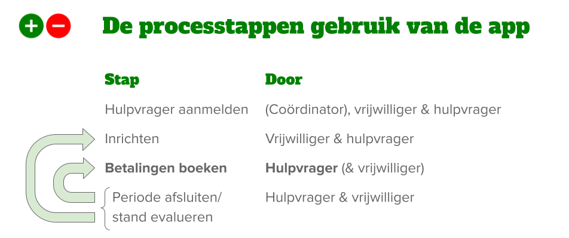

# Gebruikers interactie

## Fasering

De gebruiker die PlusMin gaat gebruiken zal een aantal stappen doorlopen:

1. aanmelden voor de app
2. samen met de vrijwilliger inrichten van de app
3. opvoeren van betalingen in de app (a.k.a. het bijhouden van het huishoudboekje)
4. evalueren van de stand van zaken en afsluiten van een periode

Na stap 4 kan met stappen 2 (wijzigen inrichting) en 3 (opvoeren betalingen) worden doorgegaan.   

In deze versie van de documentatie beperk ik me to het opvoeren van betalingen

## 3. Opvoeren betalingen

TODO: herziene versie publiceren
